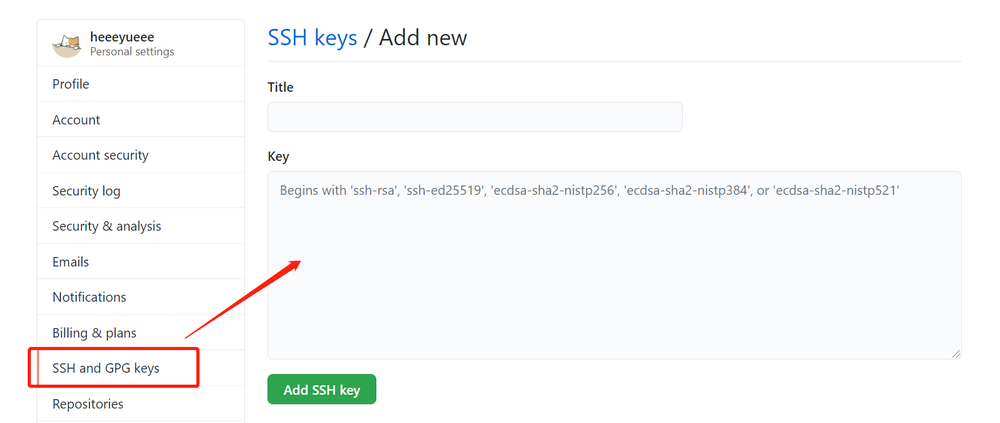

### 任务八——Git入门（远程仓库）
-----
#### 前提
  * 1.生成本台电脑（用户）的ssh密钥,执行命令:
  ```
 $  ssh-keygen -t rsa -b 4096 -C 你的邮箱
  ```
  * 2.复制生成的id_rsa.pub公钥文件中内容
  ````
 $  cat ~/.ssh/id_rsa.pub                           # 得到公钥内容
  ````

  * 3.在github设置页面添加公钥
  


  *  4.测试是否配对成功,回答yes并回车
  ````
 $  ssh -T git@github.com
  ````
-----------

#### 上传代码到远程仓库

  * 1.在github上 new repository 新建一个空白仓库
  * 2.已经有一个本地仓库（git init，git add，git commit过）
  * 3.在本地添加远程仓库的地址（在要上传的本地仓库的目录下执行命令）
  `````
 $  git remote add origin git@xxxxxxx

  `````
  
  > origin是给远程仓库标记的默认名称，可以更改

  > 使用ssh url 比较方便
* 4.把重命名本地仓库的master分支并把内容推送到远程仓库的main分支
```
$ git branch -M main
$ git push -u origin main
```
  > 默认推送到origin远程仓库的main分支

  > 如果远程仓库有新内容则需要先**git pull**拉取新内容到本地，再上传

  > 之后直接使用 **git push**上传到main 分支

----------------

#### 上传代码到其他其他分支

*  创建本地分支并上传
1. 创建本地分支，并切换到分支
```
$ git branch test

$ git checkout test
```
 2. 本地分支关联远程分支并push到远程
   ``` 
$ git push origin test:test
   ````

##### 补充：
 * 查看分支
  ```
  $ git branch -a
    master
* mutilrecall
    remotes/origin/master
    remotes/origin/mutilrecall
  ```
  > remotes开头的代表是远程分支

* 删除分支
```
$ git push origin --delete test  //删除远程分支test
```
------------

#### 下载代码到本地

  * clone的三种用法 
```
$ git clone git@?/xxx.git
```
>  会在当前目录下创建一个同名的xxx目录

>  xxx/.git 是本地仓库

> 进行后续操作前，一定要**cd xxx**进入本地仓库

````
$ git clone git@?/xxx.git name
````
> 会在本地新建name目录， 记得**cd name**
```
$ git clone git@?/xxx.git .
```
> 在本地新建的空目录中执行此命令

> 最后一个字符是点， 注意有空格

>不会新建目录， 使用当前目录容纳代码和.git

----
#### 总结：
* 常用的命令
```
$ git remote add origin git@xxxxxxx

$ git push -u origin main

$ git clone git@?/xxx.git

$ git pull

$ git push

```
* 远程仓库只是本地仓库的备份，所以变化都要先commit到本地仓库，然后push到远程
------------
#### 补充：

* 使用bash alias 简化命令
 
````````
touch ~/.bashrc
echo 'alias ga="git add"'>> ~/.bashrc
echo 'alias gc="git commit -v"'>> ~/.bashrc
echo 'alias gl="git pull"'>> ~/.bashrc
echo 'alias gp="git push"'>> ~/.bashrc
echo 'alias gch="git checkout"'>> ~/.bashrc
echo 'alias gst="git status -sb"'>> ~/.bashrc
````````

* 美化log命令

````
1.code ~/.bashrc
2.alias glog="git log --graph --pretty=format:'%Cred%h%Creset -%C(yellow)%d%Creset %s %Cgreen(%cr) %C(bold blue)<%an>%Creset' --abbrev-commit -- | less"
````

* 美化history历史命令

````
git rebase -i xxxxx(版本唯一标识)
````
