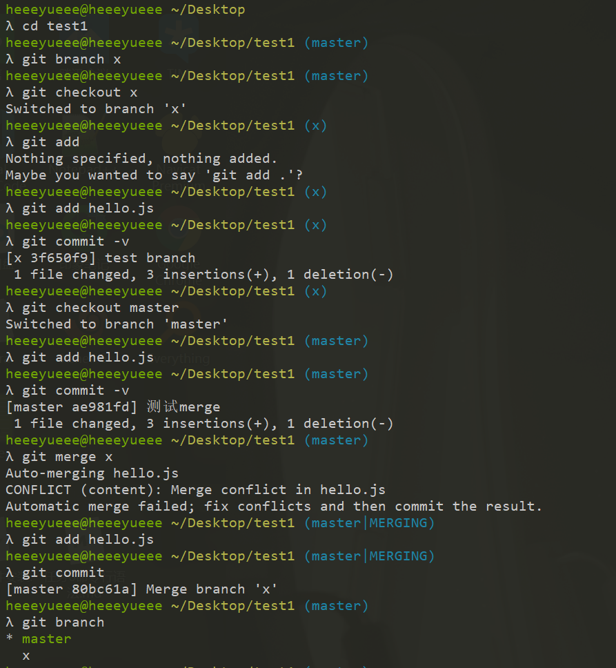

### 任务七——Git入门（本地仓库）

      ####       Git的配置

* 在cmder中进行一行行的配置

```
git config --global user.name 你的英文名
git config --global user.email 你的邮箱
git config --global push.default simple
git config --global core.quotepath false
git config --global core.editor "code --wait"
git config --global core.autocrlf input
```

*  git init

  > 初始化

* git add 文件名 

  > 把 文件标记为将要提交到本地仓库（to be committed）

* .gitignore 文件

  > 描述哪些文件是不需要提交的

* git commit -m "理由"

  >  会把已经标记为要提交的文件给提交到本地仓库，并给出理由

*  git commit -v 

  > 打开vscode来添加注释 关闭则提交，可以帮助我们回顾改了些什么，可以促使我们写出更长的提交理由

* git log

  > 显示之前的提交

* git reflog

  > 可以查看所有分支的所有操作记录（包括已经被删除的 commit 记录和 reset 的操作）

*  git reset --hard XXXXXX (git log 来查看每个版本对应的唯一版本号)

  > XXXXXX 是 commit 的号码，可以是6位，也可以是4位，也可以是 7位，只要是惟一的即可
  >
  > 运行 reset 命令前，一定要确保重要代码已经提交（commit）了，否则后悔莫及!!!

* 举例

.jpg)


----------------

   #####  分支操作

* git branch x

  >  会基于本地仓库里最新一次 commit（提交），创建一个新的分支 x

* git checkout x 

  > 会让当前目录的内容变成本地仓库里 x 分支的最新内容（可能会删除当前目录里的一些文件）
  >
  > 1.当前目录有未提交的代码， 只要跟另外一个分支不冲突，就不需要理会
  >
  > 2.如果冲突了——可以使用通灵术git stash, 也可以合并冲突

* git merge

  > 将另外一个分支合并到当前分支
  >
  > 1.有冲突(conflict 提示)
  >
  > * 使用git status -sb 查看哪个/ 哪些文件冲突了
  > *  依次打开每个文件
  > * 搜索= = = = 四个等于号
  > * 在上下两个部分中选择要保留的代码可以只选上面， 也可以只选下面， 甚至可以都选
  > * 删除不用的代码， 删除= =>>>>>< < < < 这些标记
  > * git add 对应文件
  > * 再次git status -sb, 解决下一个文件的冲突
  > * 直到没有冲突， 运行git commit （ 注意不需要选项）

* git branch  -d  x

  > 合并完后删除分支

* 举例




##### [shell bash cmd...](https://www.cnblogs.com/panchanggui/p/9582481.html)

#### 三者的区别


